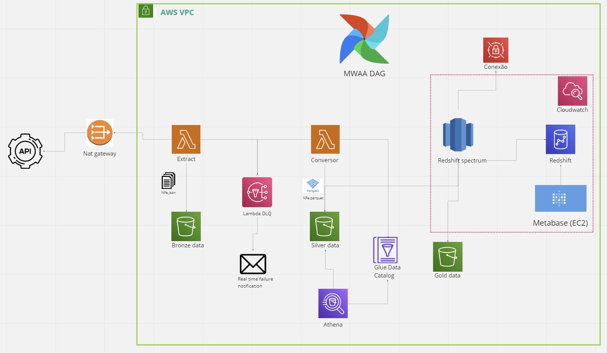

# Funcionamento
Esta arquitetura de ETL é orquestrada pelo Airflow (MWAA no exemplo), e é construída levando em consideração um sistema de DataLake dívido em 3 file systems (buckets) que contém dados em diferentes estados de transformação.

A grande vantagem desta arquitetura é sua fácil expansão através de dags dinâmicas para diferentes pipelines, e seu contra ponto é a quantidade de código necessária para fazer o sistema funcionar de forma eficiente.

A ETL funciona através de 3 tasks:

-  Extract

    Nesta task o airflow instancia um cliente boto3 e um payload com as informações necessárias para realizar o processo de extração da API de NFe e com os dados de direcionamento para o bucket correto.
    
    A lambda de extração recebe este payload e abre a comunicação com a API através da biblioteca requests.
    Para se comunicar com a API externa a VPC, a route table associada a subnet da lambda rediciona todo o tráfego outbound para o Nat gateway. A route table associada ao nat gateway envia todo tráfego outbound para um internet gateway, de modo a criar uma comunicação protegida (apenas a lambda se comunica com um serviço externo, um serviço externo não consegue se comunicar com a lambda).

    Após a extração, a lambda instancia um client boto3 que envia os arquivos de NFe em JSON para o bucket de dados bronze.

    Qualquer tipo de erro que ocorrer dentro da lambda é enviado para um SNS, que por sua vez envia uma notificação de falha no processo de extração para o time de sustentação.

- Transform

    Nesta task o airflow também instancia um cliente boto3 e um payload que é enviado para uma lambda de conversão.

    A lambda que recebe estes dados utiliza uma layer compilada com o pandas e com o arquivo python da task3 de deserialização para realizar a separação dos dataframes que serão convertidos em .parquet e enviados para bucket de dados silver.
    Esta lambda também verifica/cria um glue data catalog que serve de refência para o Athena, que pode ser utilizada para trabalhar com os dados de NFe sem nenhum tipo de regra de negócios aplicado (se necessário).

    Qualquer tipo de erro que ocorrer dentro da lambda é enviado para um SNS, que por sua vez envia uma notificação de falha no processo de extração para o time de sustentação.

- Load

    Nesta task é instanciada uma conexão com o redshift através da biblioteca psycopg2. As chaves de conexão são gerenciadas pelo secret manager.
    Após a conexão, é criada uma tabela temporária no redshift spectrum que recebe o batch dos dados do bucket silver (detalhes de dados a serem processados são gerados através da timestamp de arquivos presentes no bucket, que por sua vez é retirado através de um cliente boto3).
    Após a criação da tabela temporária, é enviada uma query para o banco Redshift que tem como fonte a tabela temporária com os dados a serem carregados. Como esse carregamento no Redshift é feito através de uma query, é permitida a agregação de regras de negócio nos dados que serão inseridos.

    Após o sucesso do processo, os dados gerados são enviados para um bucket gold pelo cliente boto3.

    Por fim, estes dados são refletidos no Metabase (ferramenta de dataviz) que tem conectores nativos com o Redshift.

    Qualquer erro e status de processamento são monitorados pela integração com o Cloudwatch.

# Hipóteses e escolha de arquitetura
Nesta arquitetura foi considerado um volume de dados a serem extraídos/convertidos que podem ser gerenciados por serviço Lambda. Isto requer a hipótese de que o fluxo de NFe traz uma quantidade não massiva de dados (embora com a capacidade de instanciar lambdas de até 10gb, ainda é possível realizar operações de média escala com este serviço) e um tempo de resposta adequado da API (se o tempo de resposta for logo, o timeout de 15min da lambda pode ser um grande gargalo, e outros desenhos de arquitetura poderiam ser mais vantajosos).

Além disso, como utilizamos o MWAA como orquestrador, seria mais vantajoso ter outras pipelines a serem gerenciadas/criadas, pois o MWAA não é um serviço barato e instância-lo para gerenciar apenas uma pipeline pode ser um desperdício.

Também foi definido que teremos toda a arquitetura dentro de uma VPC, para trazer maior segurança e aderência a compliance.

# Prós e contras
- Prós:
    - Fácil expansão para diferentes pipelines;
    - Baixo custo a longo prazo;
    - Possibilidade de analisar os dados em momentos distintos do seu ciclo de vida;
    - Segurança e compliance.

- Contras:
    - Não escalável para pipelines de processamento massivo;
    - Requer uma quantidade razoável de código para operar de forma consistente e pode ser necessária manutenção

# Melhorias sugeridas
Se tivesse mais tempo, gostaria de implementar um serviço de Delta Lake para adicionar mais compliance, aumentar o poder de flexibilidade do data lake e permitir "time travel" nos arquivos. 